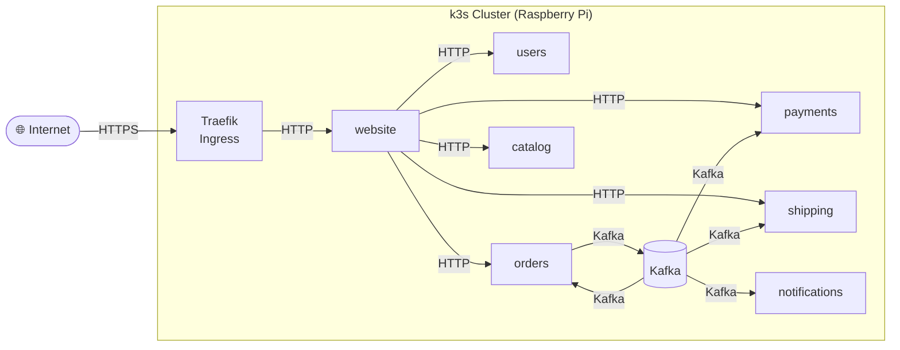
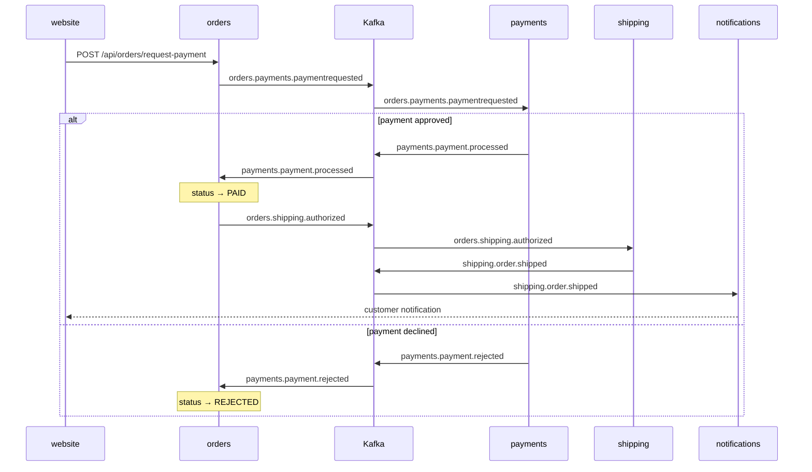

# Fakestore

> **Disclaimer:** While this project is intended as a professional demonstration of my capabilities as a software developer and architect, it is also an active sandbox. I use it to explore new languages and frameworks, push into unfamiliar territory, and test the limits of AI-assisted development. Some areas of the codebase are polished and production-grade; others are deliberately experimental. That contrast is intentional.

## About Me

I'm a software developer, systems analyst, and architect with a focus on solving real problems through well-designed systems. I work across the full stack — from distributed backend architecture to deployment infrastructure — and I have a particular interest in how complex systems fit together at scale. I enjoy picking up new technologies, identifying the right tool for the job, and building things that actually work in production.

## About This Project

**Fakestore** is a fictional e-commerce platform I built as a personal laboratory. The goals are threefold:

- **Demonstrate capability** — design and build a realistic, production-grade distributed system from scratch, end to end, without shortcuts
- **Explore AI-assisted development** — use this project as an ongoing test bed for working with AI coding tools, evaluating where they accelerate work, where they fall short, and how that workflow evolves over time
- **Try new things** — deliberately use different languages and frameworks across services to stay sharp and evaluate technologies outside my daily stack

## The System

Fakestore is a microservices platform deployed on a self-hosted Kubernetes cluster (k3s) running on a multi-node Raspberry Pi array. Services communicate asynchronously via Apache Kafka. Only the website is publicly accessible; all other services communicate over internal cluster DNS.

| Service | Stack | Role |
|---|---|---|
| [website](https://github.com/fake-store/website) | Kotlin / Spring Boot / Thymeleaf | Server-rendered frontend; the only externally exposed service |
| [users](https://github.com/fake-store/users) | Kotlin / Spring Boot | Registration, authentication, JWT issuance |
| [payments](https://github.com/fake-store/payments) | Kotlin / Spring Boot | Payment method management and order payment processing |
| [orders](https://github.com/fake-store/orders) | Java / Spring Boot | Order intake and payment request dispatch via Kafka |
| [shipping](https://github.com/fake-store/shipping) | C# / .NET 8 | Address management, shipment label generation, tracking |
| [notifications](https://github.com/fake-store/notifications) | Rust | Consumes shipped events and delivers customer notifications |
| [catalog](https://github.com/fake-store/catalog) | Java / Spring Boot | Product catalog *(in progress)* |
| [deployment](https://github.com/fake-store/fakestore-deployment) | Kubernetes / GitHub Actions | Cluster manifests, secrets management, CI/CD pipelines |

### Network Topology

> All inter-service HTTP uses internal cluster DNS: `<name>-service.fakestore.svc.cluster.local:8080`

### Kafka Event Flow

Each service is independently deployed via GitHub Actions, which builds `linux/arm64` Docker images and pushes them to GitHub Container Registry on every merge to `main`.
